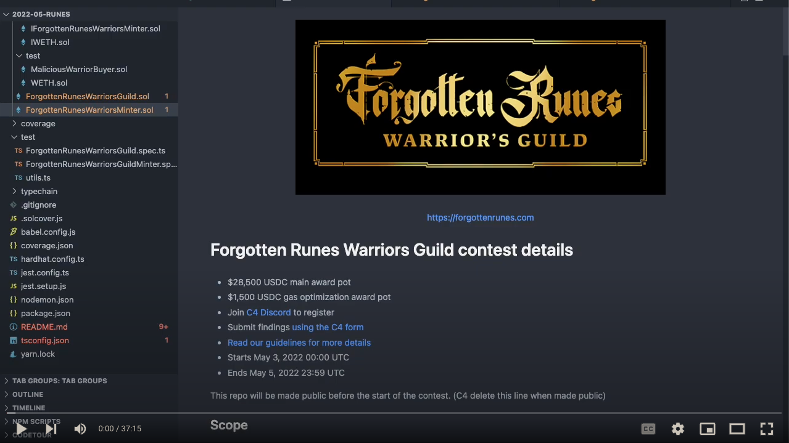

 

<a href="https://forgottenrunes.com" > https://forgottenrunes.com </a>

# Forgotten Runes Warriors Guild contest details

- $28,500 USDC main award pot
- $1,500 USDC gas optimization award pot
- Join [C4 Discord](https://discord.gg/code4rena) to register
- Submit findings [using the C4 form](https://code4rena.com/contests/2022-05-runes-contest/submit)
- [Read our guidelines for more details](https://docs.code4rena.com/roles/wardens)
- Starts May 3, 2022 00:00 UTC
- Ends May 5, 2022 23:59 UTC

This repo will be made public before the start of the contest. (C4 delete this line when made public)

## Scope

All the Solidity files are included in the audit scope, except the ones in the `contracts/test` folder.

## Overview and Readthrough Video

I've created a video that describes the project, the mint, and walks through the code which you are free to [watch here](https://www.youtube.com/watch?v=nUzl6-_o8e8).

## Coverage

`npx hardhat coverage`

## Links

- **Website** : https://forgottenrunes.com
- **Twitter** : https://twitter.com/forgottenrunes
- **Discord** : https://discord.gg/forgottenrunes

## Contact us 📝

Wardens! If you have any questions, please contact us!

#### Dotta

- **Twitter** : https://twitter.com/dotta
- **Discord** : `dotta#0001`

# Introduction

Forgotten Runes Warriors Guild is an ERC721 token. It will be minted in four phases:

1. Phase 1: True, last-price, **Dutch auction** phase (refunds above lowest bid)
2. Phase 2: **Allowlist sale** for mintlist merkletree, 1 per account at lowest DA price
3. Phase 3: **Public sale** for whatever is left at lowest DA price
4. Phase 4: **Free claim** for claimslist merkletree, 1 per account for free

Details below.

## Core Contracts

There are two main contracts:

| Name                               | LOC | Purpose             |
| ---------------------------------- | --- | ------------------- |
| `ForgottenRunesWarriorsGuild.sol`  | 82  | The ERC721 token    |
| `ForgottenRunesWarriorsMinter.sol` | 321 | The minter contract |

## The Mint

Here is a graphic presented to the community:

A longer explanation of this mint <a href="https://www.forgottenrunes.com/posts/forgotten-runes-warriors-guild-mintonomics">can be found in this blog post</a>.

The goal of this code review and bounty is to ensure that the contract can perform safely according to the communities expectations and what is communicated in that blog post. A summary version is described below.

### Phases

#### Phase 1: Last-price Dutch Auction Phase

The first phase of Warriors will be a true, last-price Dutch Auction. Everyone pays the same price.

The auction will begin on Wednesday May 11th at 10am PST.

There will be approximately 8,000 Warriors available in this phase.

The mint will start at 2.5 ETH and drop by 0.05 every 10 minutes until it reaches 0.6 ETH.

When this phase ends, refunds will be sent for whatever was paid above the final price.

That is, the final Warrior sold sets the price for everyone.

#### Phase 2: Mintlist Phase

The second phase of the Warriors sale will be for mintlist wallets only.

The mintlist phase will begin on Thursday May 12th at 10am PST.

Everyone on the mintlist will have 24 hours to mint a single Warrior.

The price of the Warrior will be the same as the final price in the Dutch Auction phase.

#### Phase 3: Public Phase

The third phase of the sale will be a public sale for all remaining Warriors that were not sold in the mintlist sale, if any.

The third phase begins Friday May 13th at 10am PST.

The price will be the price of the last Warrior sold during the Dutch auction.

Reveal will happen at the end of the Public Phase.

#### Phase 4: Claimslist Phase

After the Public Phase, accounts on the claimslist will be able to mint 1 free Warrior per account.

#### Supply Breakdown

- **Total Supply: 16,000**

Sales:

- Phase 1 Dutch Auction (`bidSummon`): 8,000
- Phase 2 Holders & Allowlist (`mintlistSummon`): ~6,200
- Phase 3 Public sale (`publicSummon`): Remaining, if any

Claims:

- Lore Writers Airdrop (`claimSummon`): ~1,100
- Forgotten Council DAO Creators Fund (`teamSummon`): ~333
- Team & Partners (`teamSummon`): ~325
- Community Honoraries and Contests (`teamSummon`): ~50

> Numbers marked with ~ are approximate.

# Architecture

## `ForgottenRunesWarriorsMinter.sol`

The minter allows minting via 5 different functions:

- `bidSummon` - buying via the Phase 1 Dutch Auction
- `mintlistSummon` - buying in Phase 2 Mintlist Phase
- `publicSummon` - buying in the Phase 3 Public Phase
- `claimSummon` - claim during Phase 4 Claimslist phase

Here's a timeline of when the various methods can be called:

    Timeline:

    bidSummon       : |------------|
    mintlistSummon  :              |------------|-------------------------------------|
    publicSummon    :                           |------------|------------------------|
    claimSummon     :                                        |------------|-----------|
    teamSummon      : |---------------------------------------------------------------|

### Configuration

The Dutch Auction needs to be configured with the proper phase times. Typically this will be done using `setPhaseTimes`.

## Ownership & Governance

Some functions of the protocol require admin rights (`onlyOwner`). The keys for this owner contract are controlled by the Magic Machine team.

## Dutch Auction Pricing

The pricing starts at 2.5 and ends at 0.6 and descends by 0.05 every 10 minutes. All of those parameters are configurable (but unlikely to be changed).

However, they are configurable because if the site goes down (e.g. DDOS) we want to be able to pause the contract and change the timings such that we don't miss out on mints at a higher price because of the site being down.

## Dutch Auction Refunds

The plan is for the _owner_ to call `issueRefunds` after Phase 1 but before Phase 2. We realize this will cost 10-20 ETH, but it feels safer than allowing self-refunds.

Currently the owner has the ability to withdraw all funds at any time. This should not break anything regarding the mint, but it presents a centralization risk to the minters in the case a refund is owed them.

Magic Machine is a known entity and registered as a U.S.-based LLC in Wyoming, meaning we are trusted to issue the refunds as we are effectively doxxed at a legal level.

That said, we'll configure a self-refund timer as a sort of protection for minters that if we aren't able to call `issueRefunds` for whatever reason, they can call themselves after the mint is complete.

Questions:

- can we lower the gas cost of `issueRefunds`?
- is the refund logic correct, even if refunds are issued multiple times?
- buyers can pay an arbitrary amount above price in the DA phase. Does this introduce rounding errors on refunds?

If the receiver tries to reject the transfer of ETH, we wrap in WETH and send that instead.

# Areas of Concern

- Withdrawing funds - is there any scenario where the team cannot withdraw funds?
- Issuing refunds - is the logic correct? Can we save gas?
- Self-refunds - is there any way someone can claim more than they're entitled to in a self-refund?
- Phase supplies - is there a problem with the supply issuance in any phase?
- DA Price calculations - is the pricing accurate within the phases of the DA?

# Known Configuration Required

- The times all need to be set correctly
- The `finalPrice` of the Dutch Auction is used in subsequent phases and it set automatically _if_ the DA sells out. If the DA fails to sell out, the owner needs to set this value manually for the subsequent phases to be priced correctly.

# Development & Testing

## Setup

- Install Node > 12
- Install Yarn
- `yarn install`

## Commands

- Compile
  `yarn compile`

- Run tests
  `yarn test`

- Run an individual test:
  `./node_modules/.bin/hardhat test --network hardhat test/ForgottenRunesWarriorsGuild.spec.ts`

- Run an individual test with watching reload:
  `nodemon --exec ./node_modules/.bin/hardhat test --network hardhat test/ForgottenRunesWarriorsGuild.spec.ts`

- Generate test coverage
  `yarn test:coverage`

- Generate a gas report
  `yarn test:gas`

See the `package.json` for a few other commands.

# License

MIT
